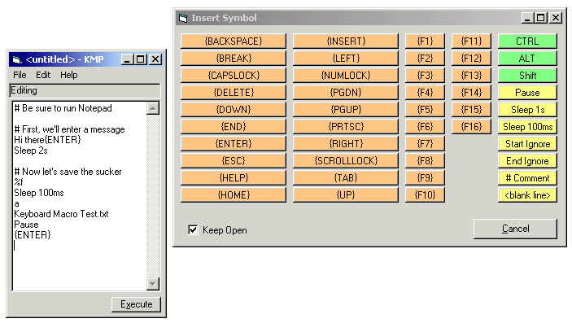



## Keyboard Macro Player

### Description

This utility allows you to create a keyboard script which, when played, sends keyboard events to your target application as though a human user had. This is a great way to deal with batch processing of tasks that you know are repetitive. It can also be used for scripting demonstrations.

In addition to just sending key combinations, the macro language allows you to pause for user intervention, wait for a number of seconds or milliseconds, insert helpful comments, and so on.

Think of it as application integration scripting.

To make your job easier, you can call up an active "cheat sheet" with all the codes for oddball keys like backspace or print-screen. The program includes a simple but complete (plain text) help file.

And you can save and later reload load your scripts, too.

Your comments are welcome. And if you like this utility, please vote for it. Thanks.

----

 Recent Updates:

 - 11/13/2000: Fixed minor bug; added features to "cheat sheet"
 
### More Info
 

             |
---                |---
**Submitted On**   |2000-11-13 20:05:24
**By**             |[James Vincent Carnicelli](https://github.com/Planet-Source-Code/PSCIndex/blob/master/ByAuthor/james-vincent-carnicelli.md)
**Level**          |Intermediate
**User Rating**    |4.8 (58 globes from 12 users)
**Compatibility**  |VB 3\.0, VB 4\.0 \(16\-bit\), VB 4\.0 \(32\-bit\), VB 5\.0, VB 6\.0
**Category**       |[Complete Applications](https://github.com/Planet-Source-Code/PSCIndex/blob/master/ByCategory/complete-applications__1-27.md)
**World**          |[Visual Basic](https://github.com/Planet-Source-Code/PSCIndex/blob/master/ByWorld/visual-basic.md)
**Archive File**   |[CODE\_UPLOAD1166411132000\.zip](https://github.com/Planet-Source-Code/james-vincent-carnicelli-keyboard-macro-player__1-12755/archive/master.zip)

